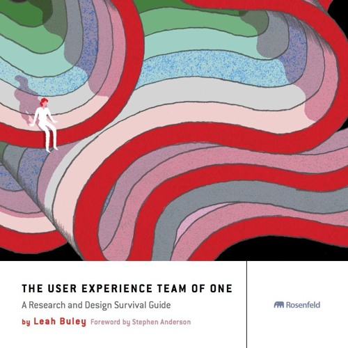

# Part 0 : Overview

> A _UX Portfolio_ is NOT a _Graphic Design portfolio._ Process and the Product.

### Overview

A User Experience (UX) Portfolio is different than traditional visual design portfolio in a number of ways:

1. **Biography**: A biography of the UX Designer’s experience, principles, skillsets, aspirations, and fields of interests.
2. **Metadata**: Relevant information about the Who, What, Where, When, Why, and How?
3. **Content**: Words, images, (and movies) to explain _deliverables_ produced.
4. **Design & Production**: Visual Design, Art Direction, Branding. Formats such as detailed PDFs, interactive sites, or video explanations, et al.
5. **Delivery**: Who will view your Portfolio? How will you promote it?

### Reference

From _The User Experience Team of One: A Research and Design Survival Guide_, reference the following chapters/sections.

* Chapter 3: _Principles over Process_
* Chapter 4: _Growing Yourself and your Career_
* Chapter 7: _Design Brief_
* Chapter 7: _Sketching_
* Chapter 9: _Mini Case Studies_

### Past Examples

See examples from past Students, but ask:

* What are the similarities and differences?
* How can each be improved?
* What will make my UX Portfolio stand out from these?

### Requirements

* \[ ] 11”x17” landscape or portrait
* \[ ] Your Biography
* \[ ] Metadata for each project
* \[ ] Content with Deliverables from _Process_ phases
* \[ ] External Links to prototypes, app, video, etc.
* \[ ] Optimize assets and reduce file size of PDF
* \[ ] Host to [Slides.com](http://slides.com), Google Slides, MilaNote, etc. but NOT FIGMA
  * \[ ] Optionally, add short video about yourself
